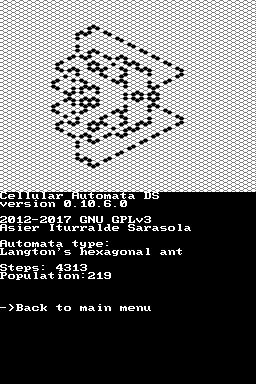
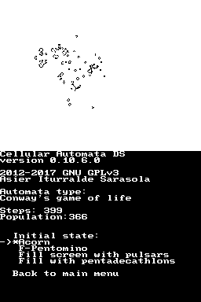
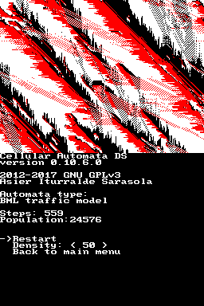
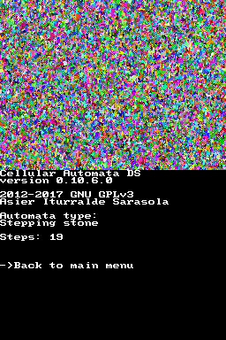

## Screenshots
---

## Requirements for building Cellular Automata DS
---

* The devkitARM SDK available at [devkitPro.org](http://devkitpro.org).

Follow [these](http://devkitpro.org/wiki/Getting_Started/devkitARM) instructions to install the SDK.

* [libnds](http://libnds.devkitpro.org/)

## How to build and run Cellular Automata DS
---

Clone this repository:

    git clone https://github.com/aldatsa/cellular-automata-ds.git

`cd` to the project's directory:

    cd cellular-automata-ds

and type the following:

    make

When it's done compiling, transfer the generated cellularautomatads.nds file to the root of your SD card.

## Developer
---

Asier Iturralde Sarasola

    <!-- Place this tag where you want the button to render. -->
    <a data-style="mega" href="https://github.com/aldatsa" class="github-button">Follow @aldatsa</a>
    <!-- Place this tag right after the last button or just before your close body tag. -->
    
    <a href="https://twitter.com/aldatsa" class="twitter-follow-button" data-show-count="false" data-size="large">Follow @aldatsa</a>
    

## License
---

Cellular Automata DS is free software/open source, and is distributed under the [GNU General Public License (GPL) version 3 license](http://www.gnu.org/licenses/gpl.html).

